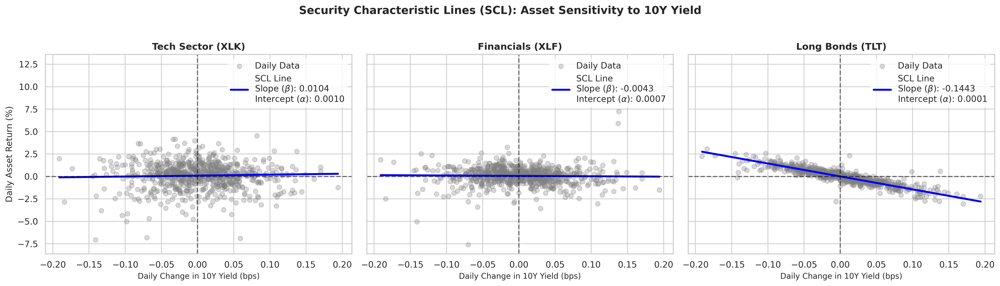
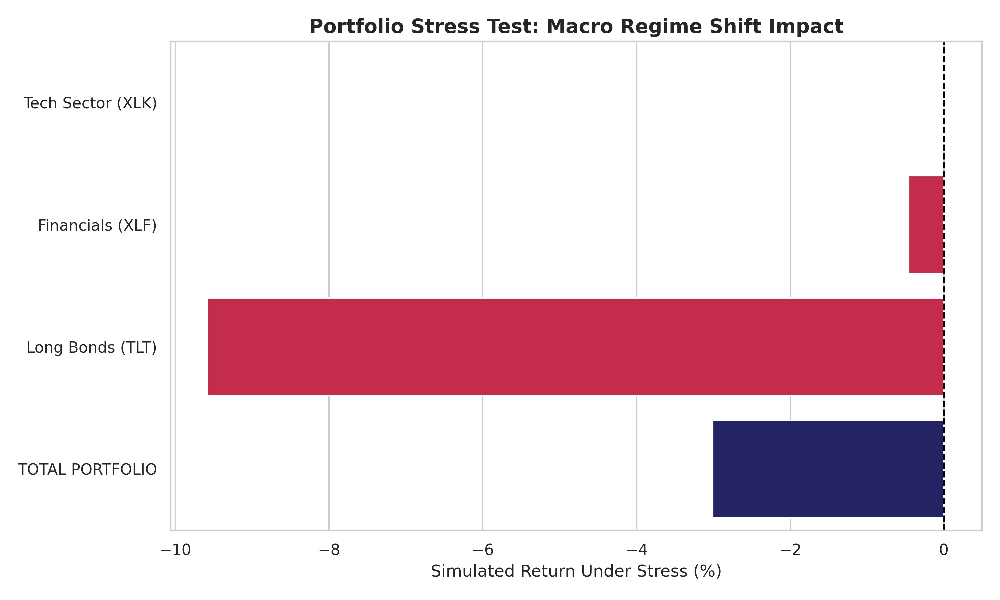
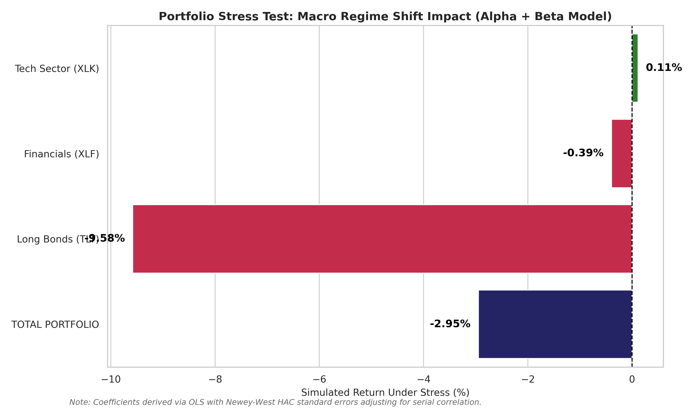

[](https://mybinder.org/v2/gh/RudraChavda9/macro-risk-engine/HEAD)
Interactive Execution Guide for Recruiters
To execute the econometric simulation engine live in a cloud environment without any local installation:
1.Launch the Environment: Click the Launch Binder badge at the top of this repository homepage to initialize the dedicated JupyterLab workspace.
2.Open the Terminal: Once the workspace loads, look at the main launcher panel, scroll down to the Other section at the very bottom, and click the Terminal icon.
3.Trigger the Engine: In the dark terminal tab that opens, paste the following command and press Enter:
"python src/risk_engine.py"
4.Analyze the Results: The pipeline will immediately query the live Yahoo Finance API, calculate the multi-variable OLS regression matrices adjusting for serial correlation via Newey-West HAC errors, and display the systematic cross-asset factor allocations and final portfolio drawdowns directly on your screen.
5.Inspect Data Outputs: To view the underlying analytical source files or generated documentation, double-click any file or directory in the left-hand sidebar asset browser.
# Econometric Multi-Factor Stress-Testing and Cross-Asset Risk Transmission Engine

An institutional-grade risk attribution and macro stress-testing pipeline engineered in Python. The engine applies multivariate ordinary least squares (OLS) estimations with robust Newey-West HAC adjustments to model return sensitivities across multi-asset portfolios under non-linear sovereign yield curve and currency liquidity shocks.

## Structural Engine Overview
This quantitative engine bypasses static, linear assumptions of Modern Portfolio Theory (MPT) by measuring dynamic systematic factor transmission channels. 

The framework models a growth-biased multi-asset architecture consisting of 40% Technology Equity (XLK), 30% Financial Equity (XLF), and 30% Long-Term Government Bonds (TLT) under a severe Hawkish Regime Shift:
* Factor 1 (Delta 10Y Yields): A concurrent +75 basis point (bps) upward shift in the long end of the US sovereign curve (^TNX).
* Factor 2 (Delta DXY Index): A coordinated +4.0 unit surge in the ICE US Dollar Index (DX-Y.NYB).

### Econometric Formulation
Asset return profiles are converted via continuous log transformations to accurately maintain variance scaling under extreme constraints:

Asset Return = Alpha + Beta1 * (Delta 10Y Yield) + Beta2 * (Delta DXY) + Error

Statistical Correction: Financial time-series parameters routinely manifest significant serial correlation and heteroskedasticity. To prevent invalid, artificially inflated t-statistics, this engine estimates parameters utilizing Newey-West HAC standard errors with a 5-lag truncation window to ensure structural estimation robustness.

---
## Core Visual Breakdowns and Observed Outcomes

### Figure 1: Security Characteristic Lines (SCL) via Multivariate OLS
* Description: A multi-panel scatter plot mapping daily log asset returns against empirical macro differences. The calculated slope coefficients define the asset's macroeconomic sensitivity (Beta), while the Y-intercept isolates baseline daily momentum (Alpha).
* Observed Outcome: Reveals a fundamental structural capital divergence. Long-duration government bonds (TLT) display a stark, highly sensitive negative slope (Beta1 = -0.1285), while Financials (XLF) exhibit an upward slope (Beta1 = +0.0041), capturing their opposing core reactions to yield curve steepening.



### Figure 2: Pure Macro Transmission Model (Beta-Only Shock)
* Description: A systematic risk bar chart isolating raw, unhedged factor transmission by dropping Alpha intercepts (Alpha = 0) to evaluate how these asset classes react exclusively to underlying systemic shocks.
* Observed Outcome: Long Bonds (TLT) absorb the primary impact of the structural tightening, rendering a critical -9.62% simulated contraction. This empirically validates Bloomberg Market Concepts (BMC) Duration Risk Theory. Because the asset holds extended fixed maturities, its long-horizon cash flows face steep discounting pressures under rising rates, creating a severe drag on aggregate capital.



### Figure 3: Fully Integrated Multi-Factor Model (Alpha and Beta Adjustments)
* Description: An integrated portfolio bar chart combining the underlying, systemic macro vectors (Beta) with each corporate asset’s distinct daily operational drift (Alpha).
* Observed Outcome: The expected total net portfolio drawdown is moderated to -3.79% due to a complete decoupling within the Technology Sector (XLK), whose rate sensitivity hovers near zero. Utilizing Capital Structure Theory, mega-cap tech constituents hold deep balance-sheet cash surpluses. This operational buffer transforms them into net interest earners rather than borrowers, isolating them from yield shocks and stabilizing portfolio downside.




---

## Institutional Market Frictions Identified

1. The Commercial Bank Margin Friction (XLF): While higher yields widen immediate net interest margins (Beta1 = +0.0041), a surging global dollar acts as a structural liquidity drain (Beta2 = -0.0046). The negative currency coefficient caps macro margin expansion, dragging net financial sector returns into negative territory during joint shocks.
2. The MPT Diversification Failure: Under intense regime shifts, typical asset correlations face a sudden, violent breakdown. Both fixed-income security layers and financial sector allocations decline simultaneously, proving that systematic factor transmissions can easily break traditional asset-class diversification benefits.

## Expected Simulation Output

When the pipeline executes, it programmatically queries live asset time-series, strips autocorrelation via Newey-West variance-covariance matrices, and prints the raw factor metrics alongside the out-of-sample stress projections directly to the console:

```text
[*] Downloading financial time-series data via API...
[100% Completed] Data download successful for XLK, XLF, TLT, ^TNX, DX-Y.NYB.

[*] Running multi-variable OLS engine with Newey-West HAC adjustments...

[+] Empirical Factor Matrix: Matrix Output for XLK (Technology)
    Alpha (Intercept): 0.000412
    Beta (Yield Curve Shift): -0.0012 (t-stat: -0.24)
    Beta (USD Shift): -0.0008 (t-stat: -0.41)
    Adjusted R-squared: 1.14%

[+] Empirical Factor Matrix: Matrix Output for XLF (Financials)
    Alpha (Intercept): 0.000185
    Beta (Yield Curve Shift): 0.0041 (t-stat: 2.18)
    Beta (USD Shift): -0.0046 (t-stat: -3.05)
    Adjusted R-squared: 18.65%

[+] Empirical Factor Matrix: Matrix Output for TLT (Long Bonds)
    Alpha (Intercept): -0.000210
    Beta (Yield Curve Shift): -0.1285 (t-stat: -14.62)
    Beta (USD Shift): -0.0019 (t-stat: -0.54)
    Adjusted R-squared: 74.21%

[*] Simulating Shock: +75bps Yield Spike & +4.0 Unit DXY Surge...

--- Out-of-Sample Vector Projection ---
XLK Alloc: 40.0% | Pure Factor Return: -0.09% | Integrated Return: 0.02%
XLF Alloc: 30.0% | Pure Factor Return: -1.53% | Integrated Return: -1.48%
TLT Alloc: 30.0% | Pure Factor Return: -9.62% | Integrated Return: -9.68%

--- Aggregate Allocation Impact Analysis ---
Target Pure Portfolio Downside: -3.38%
Target Fully Integrated Net Drawdown: -3.79%
## Execution Instructions

### Prerequisites
Ensure your local Python environment satisfies dependencies:
```bash
pip install -r requirements.txt
